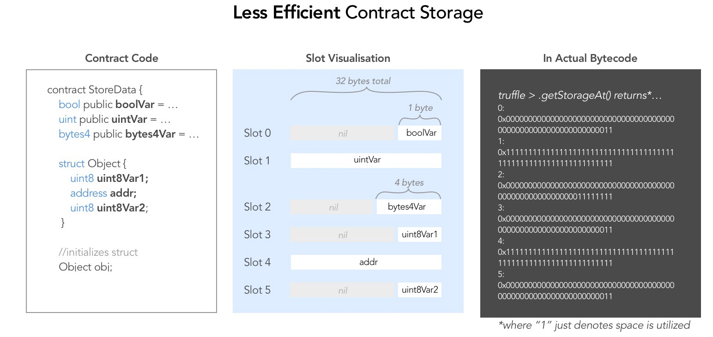

# Day 12 - Privacy

## How Ethereum optimizes data storage

Statically-sized variables (everything except mapping and dynamically-sized array types) are laid out contiguously in storage starting from position 0. Multiple items that need less than 32 bytes are packed into a single storage slot if possible

### Less Efficient Contract Storage

smaller size variables like boolVar and bytes4Var are not sequentially initialized, taking new slots 0 and 2 when they could have been packed together:



### More Efficient Contract Storage

A more efficient storage method would be to **sequentially** declare the bool (1 byte size) and the bytes4 (4 bytes size) variables. The EVM then efficiently packs the two into a single storage slot

Likewise, in the Object struct, the more efficient method is to pack the two uint8s together, taking up 1 slot. This way, all future instances of Object only take 2 slots to store, rather than 3


**Notice:** slots index at 0 from **RIGHT** to **LEFT**. Bytes4Var is initialized after boolVar, so its stored to the left of boolVar

### Exceptions

- **constants** are not stored in storage. From [Ethereum documentation](https://solidity.readthedocs.io/en/latest/contracts.html#constants), that the compiler does not reserve a storage slot for constant variables

- **Mappings** and **dynamically-sized arrays** do not stick to these conventions. More on this at a later level

## Solution

original `Privacy.sol`

```js
  bool public locked = true;
  uint256 public ID = block.timestamp;
  uint8 private flattening = 10;
  uint8 private denomination = 255;
  uint16 private awkwardness = uint16(now);
  bytes32[3] private data;
  ...
```

You should expect `locked (1 byte)`, `ID (32 bytes)`, `flattening (1 byte)`, and `denomination (1 byte)`, `awkwardness (2 bytes)` to share 3 storage slots. slots[0] => `locked`, slots[1] => `ID`, slots[2] => `flattening, denomination, awkwardness`

You should expect the data array to take up 3 remaining slots, with one slot per `data[index]`

1. To get **data[2]**, read the storage at slot **6** (`web3.eth.getStorageAt(contract.address, 5)`)
2. Cast the **bytes32** result into a **bytes16** value
3. Invoke `unlock()` with the bytes16 value

```js
const data = await web3.eth.getStorageAt(contract.address, 5);
// const key = data.slice(2, 34);
await contract.unlock(data);
```
