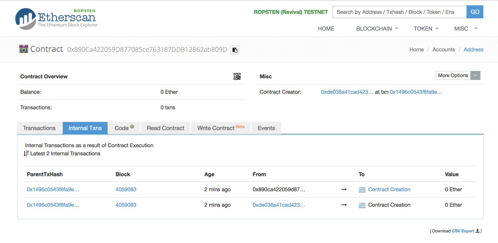
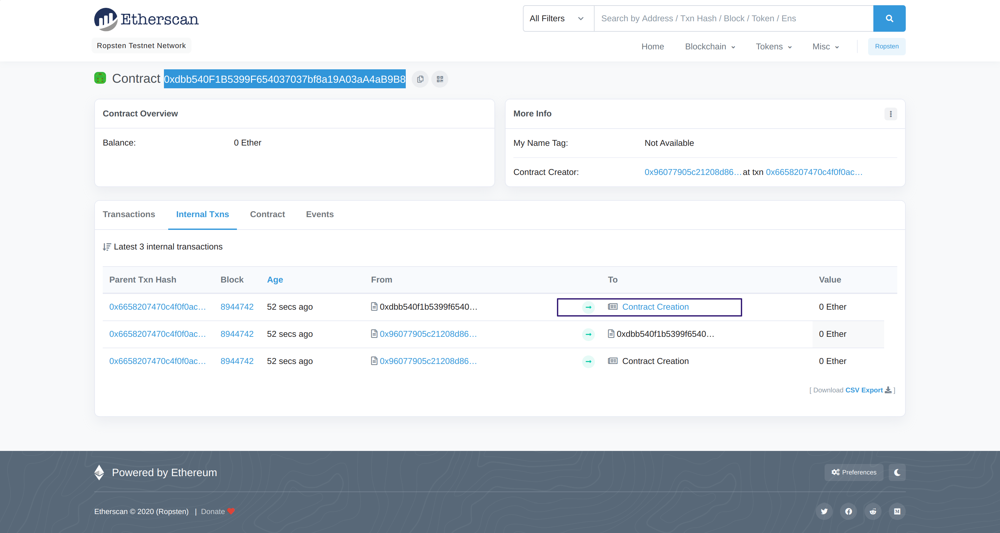

# Day 17 - Recovery

It’s a common flub for Solidity developers to lose a newly created contract address. This becomes frustrating ...

Here are two methods for finding the contract address:

- Method 1: calculate the contract address

  The address of the new account is defined as being the rightmost 160 bits of the Keccak hash of the RLP encoding of the structure containing only the sender and the account nonce.

  ```js
  address = rightmost_20_bytes(keccak(RLP(sender address, nonce)))
  ```

  - **sender address**: is the contract or wallet address that created this new contract

  - **nonce**: is the number of transactions sent from the sender address OR, if the sender is a factory contract, the nonce is the number of contract-creations made by this account.

  - **RLP**: is an encoder on data structure, and is the default to serialize objects in Ethereum.

  - **keccak**: is a cryptographic primitive that compute the Ethereum-SHA-3 (Keccak-256) hash of any input.

Let’s calculate the address of a new contract created by an existing contract located at `0x890ca422059d877085ce763187ddb12b62ab809d`. Let’s assume that this is the first ever contract creation from this address, so the nonce (transaction count) should be 1.

**Interesting fact**: nonce 0 is always the smart contract’s own creation event

1. From [documentation](https://github.com/ethereum/wiki/wiki/RLP), the RLP encoding of a 20-byte address is: 0xd6, 0x94. And for all integers less than 0x7f, its encoding is just its own byte value. So the RLP of 1 is 0x01.

2. In Remix, compute the following:

```js
address public a = address(keccak256(0xd6, 0x94, YOUR_ADDR, 0x01));
// this yields `0x048559A2982f50c268B80E14b1A98A1524295016`
```

- Method 2: use Etherscan

  - In Etherscan, look up your current contract by address.
  - Inside the `Internal Txns` tab, locate the latest contract creation, and click on the link into the new contract.
  - The new contract address should now show at the top left hand corner.



## Solution

1. Get the contract address `0xdbb540F1B5399F654037037bf8a19A03aA4aB9B8`

2. Check internal txns on etherscan. Find the lost contract address `0xfEe930ECDc47be195548E9482198C33167C3a1c9`

   

3. run `destory` to get the token back

   ```js
   const data = web3.eth.abi.encodeFunctionCall(
   	{
   		name: "destroy",
   		type: "function",
   		inputs: [
   			{
   				type: "address",
   				name: "_to",
   			},
   		],
   	},
   	[player]
   );

   await web3.eth.sendTransaction({
   	to: "<insert the address of the lost contract>",
   	from: player,
   	data: data,
   });
   ```
