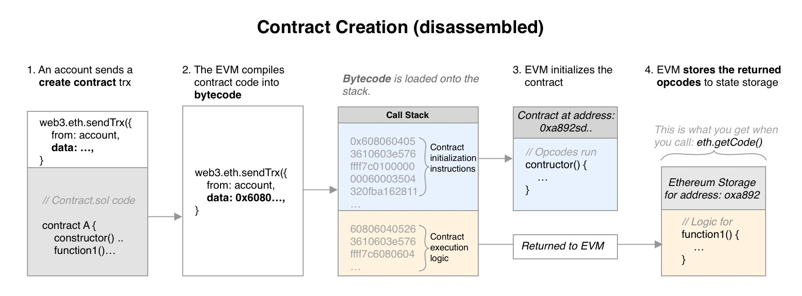

# Day 18 - MagicNumber

This level requires some assembly programming to deploy a tiny contract to the EVM.



## What happens during contract creation

1. **First, a user or contract sends a transaction to the Ethereum network.** This transaction contains data, but no recipient address. This format indicates to the EVM that is a contract creation, not a regular send/call transaction.

2. **Second, the EVM compiles the contract code in Solidity (a high level, human readable language) into bytecode (a low level, machine readable language).** This bytecode directly translates into opcodes, which are executed in a single call stack.

   **Important to note:** contract creation bytecode contains both 1)initialization code and 2) the contract’s actual runtime code, concatenated in sequential order.

3. **During contract creation, the EVM only executes the initialization code until it reaches the first STOP or RETURN instruction in the stack.** During this stage, the contract’s constructor() function is run, and the contract has an address.

4. **After this initialization code is run, only the runtime code remains on the stack.** These opcodes are then copied into memory and returned to the EVM.

5. **Finally, the EVM stores this returned, surplus code in the state storage, in association with the new contract address.** This is the runtime code that will be executed by the stack in all future calls to the new contract.

To solve this level, you need 2 sets of opcodes:

- Initialization opcodes: to be run immediately by the EVM to create your contract and store your future runtime opcodes, and

- Runtime opcodes: to contain the actual execution logic you want. This is the main part of your code that should return 0x 0x42 and be under 10 opcodes.

### Runtime opcodes

Returning values is handled by the RETURN opcode, which takes in two arguments:

- p: the position where your value is stored in memory, i.e. 0x0, 0x40, 0x50 (see figure). Let’s arbitrarily pick the `0x80` slot.
- s: the size of your stored data. Recall your value is 32 bytes long (or 0x20 in hex).

Before you can return a value, first you have to store it in memory.

1. First, store your 0x42 value in memory with `mstore(p, v)`, where p is position and v is the value in hexadecimal (0x2a):

```compile
0x602a     ;PUSH1 0x2a                  v
0x6080     ;PUSH1 0x80                  p
0x52       ;MSTORE
```

2. Second, you can return this the 0x42 value:

```compile
6020    // s: push1 0x20 (value is 32 bytes in size)
6080    // p: push1 0x80 (value was stored in slot 0x80)
f3      // return
```

This resulting opcode sequence should be `602a60805260206080f3`

### Initialization opcodes

initialization codes copies runtime codes to memory and returns the opcode to EVM

Copying code from one place to another is handled by the opcode `codecopy`, which takes in 3 arguments:

- t: the destination position of the code, in memory. Let’s arbitrarily save the code to the 0x00 position.

- f: the current position of the runtime opcodes, in reference to the entire bytecode. Remember that f starts after initialization opcodes end. What a chicken and egg problem! This value is currently unknown to you.

- s: size of the code, in bytes. Recall that 602a60805260206080f3 is 10 bytes long (or 0x0a in hex).

```compile
;copy bytecode to memory
0x600a     ;PUSH1 0x0a                      S(runtime code size)
0x60??     ;PUSH1 0x??                      F(current position of runtime opcodes)
0x6000     ;PUSH1 0x00                      T(destination memory index 0)
0x39       ;CODECOPY
```

```compile
;return code from memory to EVM
0x600a     ;PUSH1 0x0a                      S
0x6000     ;PUSH1 0x00                      P
0xf3       ;RETURN
```

Notice that in total, your initialization opcodes take up 12 bytes, or 0x0c spaces. This means your runtime opcodes will start at index 0x0c, where f is now known to be 0x0c:

```compile
;copy bytecode to memory
0x600a     ;PUSH1 0x0a                      S(runtime code size)
0x600c     ;PUSH1 0x??                      F(current position of runtime opcodes)
0x6000     ;PUSH1 0x00                      T(destination memory index 0)
0x39       ;CODECOPY
```

So the initialization code sequence is `600a600c600039600a6000f3`

Finally the opcodes is `0x600a600c600039600a6000f3602a60805260206080f3`

```js
const bytecode = "0x600a600c600039600a6000f3602a60805260206080f3";
const tx = await web3.eth.sendTransaction({ from: player, data: bytecode }); // step 2
await contract.setSolver("contract address"); // contract address got from step 2
```
