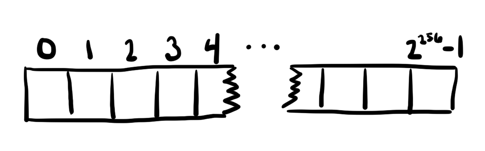
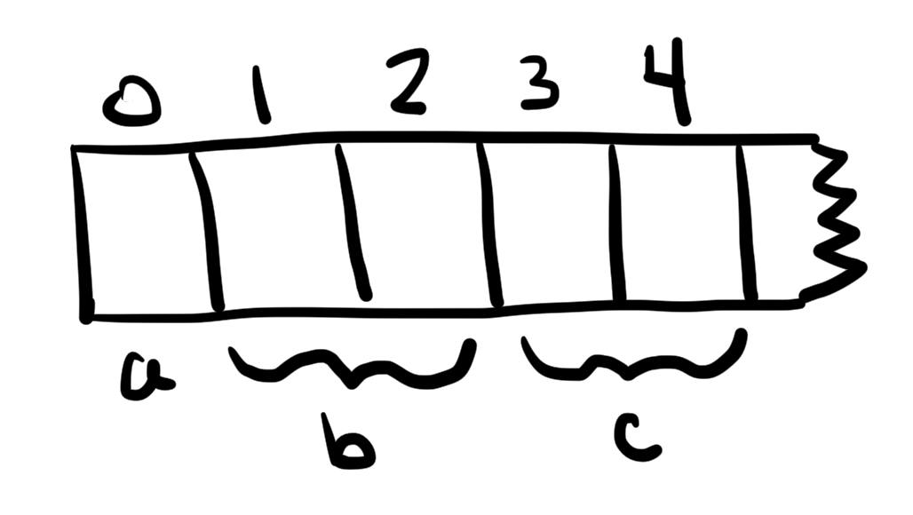
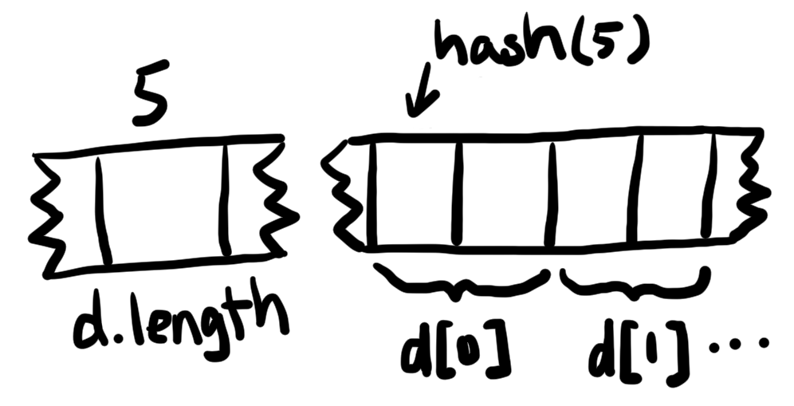
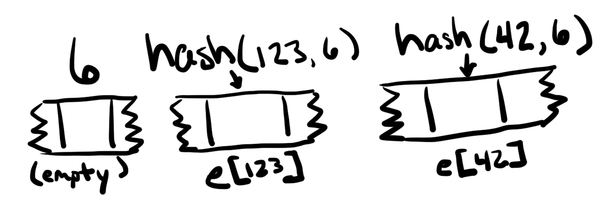

# Day 19 - AlienCodex

AlienCodex is inherited from `Ownable` so in order to do that we want to override \_owner variable in the contract's storage with our address

## How arrays stored

[document](https://programtheblockchain.com/posts/2018/03/09/understanding-ethereum-smart-contract-storage/)

Each smart contract running in the EVM maintains state in its own permanent storage. This storage can be thought of as a very large array, initially full of zeros. Each value in the array is 32-bytes wide, and there are 2^256 such values. A smart contract can read from or write to a value at any location. That’s the extent of the storage interface.



Because zeros don’t take up any space, storage can be reclaimed by setting a value to zero. This is incentivized in smart contracts with a gas refund when you change a value to zero.

### Locating Fixed-Sized Values

```js
contract StorageTest {
    uint256 a;
    uint256[2] b;

    struct Entry {
        uint256 id;
        uint256 value;
    }
    Entry c;
}
```

In the above code:

**a** is stored at slot 0
**b** is stored at slots 1, and 2 (one for each element of the array).
**c** is stored at slots 3, and 4



### Locating Dynamically-Sized Values

Using reserved slots works well for fixed-size state variables, but it doesn’t work for dynamically-sized arrays and mappings because there’s no way of knowing how many slots to reserve.

#### Dynamically-Sized Arrays

A dynamically-sized array needs a place to store its size as well as its elements.

```js
contract StorageTest {
    uint256 a;     // slot 0
    uint256[2] b;  // slots 1-2

    struct Entry {
        uint256 id;
        uint256 value;
    }
    Entry c;       // slots 3-4
    Entry[] d;
}
```

In the above code, the dynamically-sized array d is at slot 5, but the only thing that’s stored there is the size of d. The values in the array are stored consecutively starting at the **keccak256 hash of the slot**. There are 2^256 locations to choose from in storage, which is approximately the number of atoms in the known, observable universe. You could choose storage locations at random without ever experiencing a collision.



The following Solidity function computes the location of an element of a dynamically-sized array:

```js
function arrLocation(uint256 slot, uint256 index, uint256 elementSize)
    public
    pure
    returns (uint256)
{
    return uint256(keccak256(slot)) + (index * elementSize);
}
```

#### Mappings

```js
contract StorageTest {
    uint256 a;     // slot 0
    uint256[2] b;  // slots 1-2

    struct Entry {
        uint256 id;
        uint256 value;
    }
    Entry c;       // slots 3-4
    Entry[] d;     // slot 5 for length, keccak256(5)+ for data

    mapping(uint256 => uint256) e;
    mapping(uint256 => uint256) f;
}
```

In the above code, the location for e is slot 6, and the location for f is slot 7, but nothing is actually stored at those locations. (There’s no length to be stored, and individual values need to be located elsewhere.)

To find the location of a specific value within a mapping, the key and the mapping’s slot are hashed together.



The following Solidity function computes the location of a value:

```js
function mapLocation(uint256 slot, uint256 key) public pure returns (uint256) {
    return uint256(keccak256(key, slot));
}
```

Note that when keccak256 is called with multiple parameters, the parameters are concatenated together before hashing. Because the slot and key are both inputs to the hash function, there aren’t collisions between different mappings.

#### Combinations of Complex Types

Dynamically-sized arrays and mappings can be nested within each other recursively. When that happens, the location of a value is found by recursively applying the calculations defined above. This sounds more complex than it is.

```js
contract StorageTest {
    uint256 a;     // slot 0
    uint256[2] b;  // slots 1-2

    struct Entry {
        uint256 id;
        uint256 value;
    }
    Entry c;       // slots 3-4
    Entry[] d;     // slot 5 for length, keccak256(5)+ for data

    mapping(uint256 => uint256) e;    // slot 6, data at h(k . 6)
    mapping(uint256 => uint256) f;    // slot 7, data at h(k . 7)

    mapping(uint256 => uint256[]) g;  // slot 8
    mapping(uint256 => uint256)[] h;  // slot 9
}
```

To find items within these complex types, we can use the functions defined above.

To find `g[123][0]`:

```js
// first find arr = g[123]
arrLoc = mapLocation(8, 123); // g is at slot 8
// then find g[123][0]
itemLoc = arrLocation(arrLoc, 0, 1);
```

To find `h[2][456]`:

```js
// first find arr = h[2]
mapLoc = arrLocation(9, 2, 1); // h is at slot 9
// then find h[2][456]
itemLoc = mapLocation(mapLoc, 456);
```

## Solution

The `owner` varible in `Ownable.sol` is in `slot 0` (`contact` varible in `slot 0` as well) slot 0: contact | owner

```js
await web3.eth.getStorageAt(instance, 0, function (x, y) {
	console.info(y);
});
// 0x00000000000000000000000073048cec9010e92c298b016966bde1cc47299df5
```

while contact is `0x0`, owner is `0x73048cec9010e92c298b016966bde1cc47299df5`

`codex` is stored at `slot 1`. We can get the item storage slot by `keccak256(bytes32(1))`
